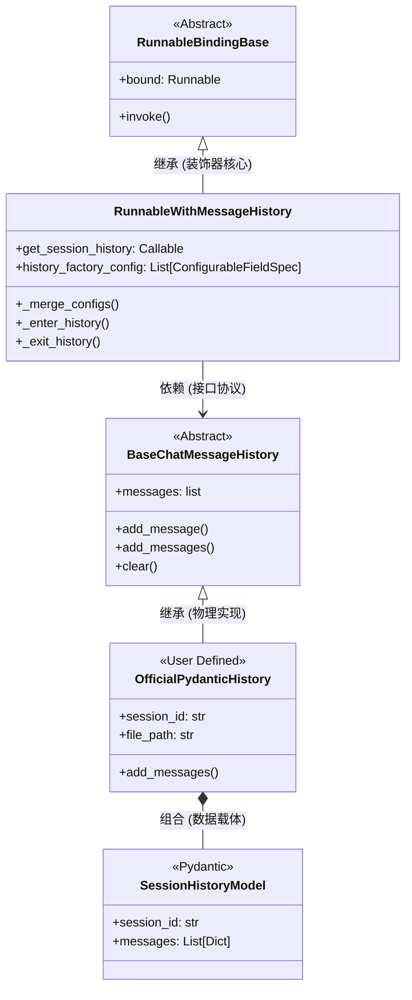
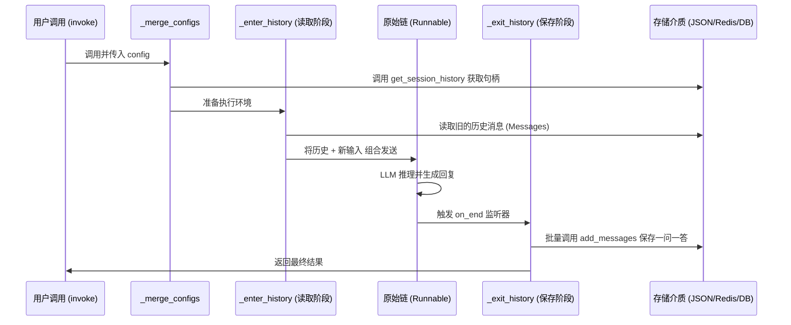

# LangChain 源码底层解析：长期会话记忆执行拆解

为了彻底搞懂 LangChain 的会话持久化（Memory Persistence）机制，我们直接向底层 `langchain_core/runnables/history.py` 要答案。本文档将结合**架构拓扑图、生命周期流程图、以及核心源码逐行剖析**，为你带来真正的“上帝视角”。

---

## 1. 全局架构设计：类与组件的依赖关系

我们首先从宏观上看看，我们在外面随手写的代码，在底层是如何拼装成一台“记忆引擎”的。



**架构解读**：
*   `RunnableWithMessageHistory` 是一个**代理人（Proxy/Wrapper）**，它本身不存数据，它的任务是“拦截”你的请求，帮你去拿数据。
*   它通过 `get_session_history` 这个工厂钩子，向你勒索一个符合 `BaseChatMessageHistory` 标准的“储物箱”。
*   我们自己写的 `OfficialPydanticHistory` 就是这个储物箱，底层则依赖 Pydantic（`SessionHistoryModel`）保证数据不腐坏。

---

## 2. 宏观时序图：组件间的信息流转

在深入代码之前，我们先看看一个普通的 `invoke` 是如何在这几个核心组件之间一来一回流转的。这个时序图展示了“预处理 -> 核心运行 -> 后处理”的严谨顺序。



---

## 3. 记忆的生命周期：一次 Invoke 的完整流程图

当你敲下 `chain.invoke({"input": "我是大卫"}, config={"configurable": {"session_id": "123"}})` 时，系统到底跑了多远？

```mermaid
graph TD
    Start((User Invoke)) --> A[_merge_configs: 预热阶段]
    
    subgraph 阶段一：环境准备 (Config Merge)
        A --> B{提取 session_id}
        B -->|找到 123| C[调用 get_session_history]
        B -->|未找到| Error[抛出 ValueError]
        C --> D[生成 OfficialPydanticHistory 实例]
        D --> E[将实例挂载到 config 隐藏字段]
    end

    E --> F[_enter_history: 读取阶段]

    subgraph 阶段二：拼装记忆 (Load History)
        F --> G[从 config 取出历史实例]
        G --> H[触发 hist.messages 读取全量硬盘数据]
        H --> I[历史消息 + 你的新 input 打包成 List]
    end

    I --> J((LLM 核心推理))

    subgraph 阶段三：持久化落盘 (Save History)
        J -->|推理完成触发 on_end| K[_exit_history: 保存阶段]
        K --> L[从 Run 对象提取人类的新 Input]
        K --> M[从 Run 对象提取 AI 的新 Output]
        L & M --> N[合并这轮对话的 2 条消息]
        N --> O[调用 hist.add_messages 批量写入硬盘]
    end

    O --> Finish((返回最后回复给 User))

    style Start fill:#2ecc71,stroke:#27ae60,color:#fff
    style Finish fill:#3498db,stroke:#2980b9,color:#fff
    style J fill:#f39c12,stroke:#d35400,color:#fff
```

---

## 3. 核心机制：源码级深度拆解

为了彻底搞懂其底层运作，我们直接剖析 `langchain_core/runnables/history.py` 中的真实源码。

### A. `session_id` 提取与工厂函数调用 (`_merge_configs`)
当链被触发执行时，首先会进入 `_merge_configs` 方法来预热环境并提取 ID。

```python
# 源码片段：_merge_configs (第 572-617 行)
def _merge_configs(self, *configs: RunnableConfig | None) -> RunnableConfig:
    config = super()._merge_configs(*configs) # 合并父类配置
    
    # 1. 扫描你的声明：你想在 config 里提取什么参数？(默认是 session_id)
    expected_keys = [field_spec.id for field_spec in self.history_factory_config]
    configurable = config.get("configurable", {})

    # 2. 核心调用：提取出值并交给你的提货工（工厂函数）
    if len(expected_keys) == 1:
        if parameter_names:
            # 相当于执行了: message_history = get_session_history("123")
            message_history = self.get_session_history(
                configurable[expected_keys[0]]
            )
    else:
        # 支持多参数 (如 user_id, session_id) 解包调用
        message_history = self.get_session_history(
            **{key: configurable[key] for key in expected_keys}
        )
    
    # 3. 关键动作：将你返回的实例，悄悄塞进接力棒中
    config["configurable"]["message_history"] = message_history
    return config
```

### B. 读取历史消息：环境装载 (`_enter_history`)
LLM 需要上下文才能推理，所以系统会在调用大模型前，先触发这段读取逻辑。

```python
# 源码片段：_enter_history (第 512-522 行)
def _enter_history(self, value: Any, config: RunnableConfig) -> list[BaseMessage]:
    # 1. 精准找到在上一环挂载的那个历史实例 (OfficialPydanticHistory)
    hist: BaseChatMessageHistory = config["configurable"]["message_history"]
    
    # 2. 触发读取：这会调用你的 @property messages 方法，读取本地 .json
    messages = hist.messages.copy()

    # 3. 拼接对话：把[旧的十句话] + [你刚刚敲下的一句话]，合并成一个大数组
    if not self.history_messages_key:
        input_val = value if not self.input_messages_key else value[self.input_messages_key]
        messages += self._get_input_messages(input_val)
        
    return messages # 喂给大模型！
```

### C. 保存对话历史：闭环 (`_exit_history`)
当 LLM 完成推理后，通过框架层的监听器 (`on_end`) 拦截执行，悄悄完成收尾工作。

```python
# 源码片段：_exit_history (第 538-553 行)
def _exit_history(self, run: Run, config: RunnableConfig) -> None:
    # 1. 再次找到那个实例
    hist: BaseChatMessageHistory = config["configurable"]["message_history"]

    # 2. 抓取输入：从本次运行的追踪日志 (run 对象) 中找出人类问的问题
    inputs = load(run.inputs, allowed_objects="all")
    input_messages = self._get_input_messages(inputs)

    # 3. 抓取输出：从追踪日志中找出 AI 生成的回答
    output_val = load(run.outputs, allowed_objects="all")
    output_messages = self._get_output_messages(output_val)
    
    # 4. 决胜时刻：将 [人类的一句, AI的一句] 组合，一次性写入！
    hist.add_messages(input_messages + output_messages) 
```

---

## 4. 性能优化原理对比：`add_message` vs `add_messages`

结合上面 `_exit_history` 最后一行代码 `hist.add_messages(input_messages + output_messages)`，我们来看看如果不优化会发生什么惨剧：

| 对比项 | ❌ `add_message` (旧方案，单次写入) | ✅ `add_messages` (优化方案，批量写入) |
| :--- | :--- | :--- |
| **底层表现** | 基类 `BaseChatMessageHistory` 内部退化为 `for` 循环 | 直接接管上述数组：`[Human("你好"), AI("你好呀")]` |
| **文件打开次数** | 🔪 被打开 2 次，关闭 2 次 | ⚡ 仅打开 1 次，一次性追加并覆盖 |
| **Pydantic序列化** | 校验解构 2 次硬盘的全部 JSON 文本 | ⚡ 在内存中推导好 `dict` 列表后，一次性 `model_dump_json` |
| **实际业务影响** | 如果你的记忆保存在 MySQL/Redis，单次对话会**消耗 2 个数据库连接/2 次网络请求** | **恒定只消耗 1 次网络请求/事务**，高并发下拯救服务器 |

---

## 5. 工程卓越性总结

通过深入这层源码，我们不仅知其然，更知其所以然。在我们的项目中，必须遵守以下铁律：
1.  **绝不退化为单次 I/O**：凡是在 `BaseChatMessageHistory` 的子类中，**强制要求重写** `add_messages`。
2.  **让序列化回归官方**：永远不要自己去手写 `json.dumps(message.content)`，必须使用 `message_to_dict` 保证元数据（`tool_calls`, `kwargs`）不丢失。
3.  **配置驱动**：善用 `ConfigurableFieldSpec`，你可以传入比 `session_id` 更复杂的信息（比如 `tenant_id`, `user_id`）并让 LLM 框架自动解析传递给你的工厂。
