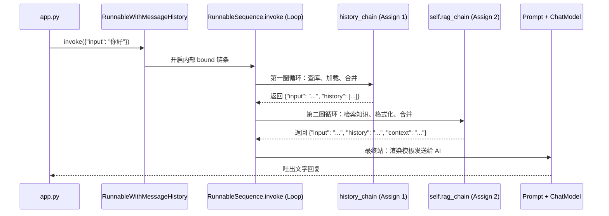

# LangChain 源码解析：LCEL 执行全流程 —— 从“点火”到“生成”的每一毫秒

> **文档编号**: 01-LCEL-DEEP-DIVE-08
> **归档时间**: 2026-03-23
> **解析专家**: `@qa_archiver`
> **核心组件**: `RunnableWithMessageHistory`, `RunnableSequence`, `RunnableAssign`

---

## 1. 概览：点火瞬时
在 RAG 系统中，当我们调用 `final_chain.invoke({"input": "你好"})` 时，系统并不是直接运行检索逻辑，而是启动了一场跨越多个核心库文件的 **“数据接力赛”**。

---

## 2. 阶段详解：执行链路全追踪

### 第一站：外部包装器的“分流器”
*   **文件**: `langchain_core/runnables/base.py`
*   **核心类**: `RunnableBindingBase`
*   **动作**: 拦截原本发出的请求，将其委派给内部的 `self.bound` 对象。
*   **源码逻辑 (Line 5695)**: 
    ```python
    return self.bound.invoke(input, self._merge_configs(config), **kwargs)
    ```
*   **数据状态**: `{"input": "你好"}`

### 第二站：流水线的“控制中心”
*   **文件**: `langchain_core/runnables/base.py`
*   **核心类**: `RunnableSequence` (由 `|` 操作符产生)
*   **动作**: 开启一个 `for` 循环，依次调取链条中的每一个组件。
*   **物理机制 (Line 3148)**: 
    ```python
    for i, step in enumerate(self.steps):
        # 将上一步的输出结果(input_) 重新赋值为 下一步的输入
        input_ = context.run(step.invoke, input_, config)
    ```

### 第三站：第一级注入 —— 补给历史 (`history_chain`)
*   **文件**: `langchain_core/runnables/passthrough.py` -> `history.py`
*   **动作**: 第一次 `assign(history=...)` 注入。
*   **步骤关键点**:
    1.  调用 `_enter_history` 查库（使用 `.copy()` 防御性编程）。
    2.  利用字典解包 `{**value, **{"history": messages}}` 完成合并。
*   **数据状态**: `{"input": "你好", "history": [旧消息1, 旧消息2]}`

### 第四站：动态路由 —— 找到主逻辑
*   **文件**: `langchain_core/runnables/history.py`
*   **组件**: `RunnableLambda(_call_runnable_sync)`
*   **动作**: 根据输入字典的环境（同步或异步），直接返回你在引擎里定义的 `self.rag_chain` 核心对象。
*   **特性**: `RunnableSequence` 会无缝衔接，立刻调用这个返回的链条。

### 第五站：第二级注入 —— 检索知识 (`RagPipelineEngine`)
*   **文件**: `src/03-RAG项目实战/core/rag_chain.py`
*   **动作**: 第二次 `assign(context=...)` 注入。
*   **执行子链条**: `itemgetter("input") | retriever | format_docs`。
*   **数据状态**: `{"input": "...", "history": [...], "context": "知识库文本"}`

---

## 3. 核心机制解析

### 3.1 为什么会有 `RunnableSequence`？ (由 `|` 产生)
在 `Runnable` 基类中，重载了管道运算符：
*   **源码处 (base.py L637)**: `__or__` 方法会接收操作符左右两侧的对象，并返回一个新的 `RunnableSequence` 实例。这正是 LCEL 能够像拼积木一样组合的核心原理。

### 3.2 变量解包的魔力
在 `RunnableAssign` 的底层实现中，每一个 `assign` 都是通过以下逻辑保留历史的：
```python
# passthrough.py 核心精简
def _invoke(self, value):
    return {
        **value,  # 保留该点的所有旧变量（如已注入的 history）
        **self.mapper.invoke(value) # 增加本次计算的新值（如 context）
    }
```

---

## 4. 全流程接力图



---
**本归档文档生成于 `d:\8-python-project\Cinemind\document\01-LangChain源码底层解析\08-LangChain_LCEL源码底层执行全流程解析_由点火到生成的每一个毫秒.md`**
