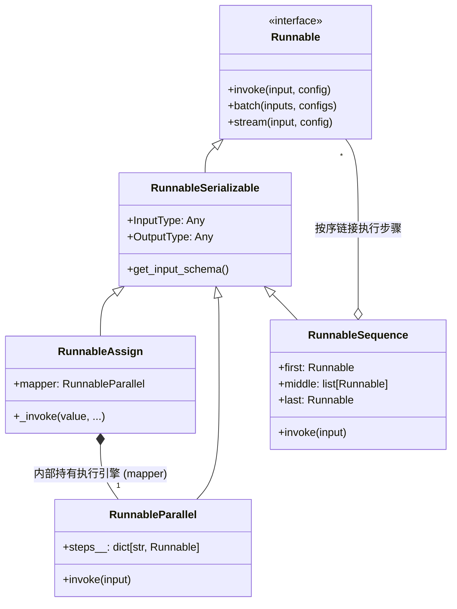
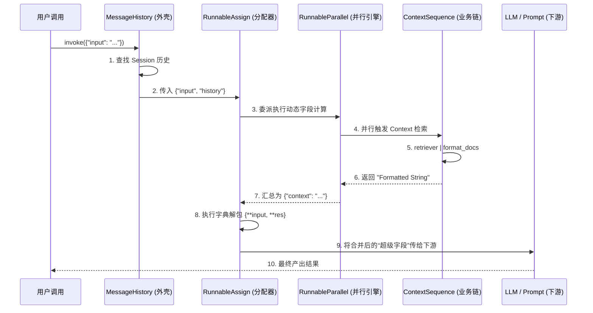
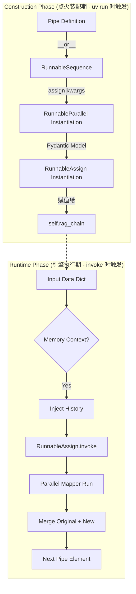

# LangChain LCEL 核心组件架构与执行流转源码大拆解

本篇文档由 `Source Code Teardown` (源码底层拆解分析规范) 驱动生成。不再停留在业务逻辑的表面描述，而是深入 `langchain-core` 核心层，通过类图、时序图与生命周期流转，为你还原 LCEL 的物理真实运行世界。

---

## 模块一：全局架构设计 (Global Architecture Design)

LangChain 的核心是一个高度抽象的 `Runnable` 体系。它通过组合 (Composition) 而非单纯的继承，构建了一个灵活的执行引擎。



**架构解析**：
- **`Runnable`**：这是整个帝国的基石，定义了所有组件必须遵守的“接力协议”。
- **`RunnableAssign`**：它是一个“外壳”，其核心执行力完全委派给了内部的 `RunnableParallel`。
- **`RunnableParallel`**：真正的多线程/异步执行引擎，负责管理所有并行的命名子任务。

---

## 模块二：宏观时序流转图 (Macro Sequence Flow)

当你在 `rag_chain.py` 中触发 `final_chain.invoke()` 时，数据包经历了以下精确的时序跳转：



---

## 模块三：生命周期逻辑流程图 (Lifecycle & Logic Flow)

LCEL 的生命周期分为 **“静态装配期 (Construction)”** 与 **“动态执行期 (Runtime)”**。理解两者的边界是解决 `TypeError` 的关键。



---

## 模块四：核心机制源码深度拆解 (Core Code Deep Dive)

### 1. `RunnableAssign` 的“缝合”逻辑
这是将 RAG 背景注入输入字典的关键物理点。

```python
# langchain_core/runnables/passthrough.py
def _invoke(
    self,
    value: dict[str, Any], # 1. 初始输入
    run_manager: CallbackManagerForChainRun,
    config: RunnableConfig,
    **kwargs: Any,
) -> dict[str, Any]:
    # 2. 核心递归调用
    return {
        **value, # 3. 解包并保留“老本”
        **self.mapper.invoke( # 4. 委派 Parallel 引擎算出“新账”
            value,
            patch_config(config, callbacks=run_manager.get_child()),
            **kwargs,
        ),
    }
```
**逐点剖析**：
- **# 1**：这里强制要求 `value` 是 `dict`，因为接下来的 `**` 操作符只认字典。
- **# 3**：这是 `assign` 和 `passthrough` 的最大区别。这一行确保了你的 `input` 字段永远不会在流转中丢失。
- **# 4**：注意 `run_manager.get_child()`。它创建了一个子追踪 span。这保证了在 LangSmith 里，你的检索任务会整齐地排在 assign 任务下面。

### 2. `RunnableSequence` 的“接力”逻辑
这是 `|` 运算符背后的 CPU 实际动作。

```python
# langchain_core/runnables/base.py
def invoke(self, input: Input, config: RunnableConfig | None = None, **kwargs: Any) -> Output:
    input_ = input # 1. 握住第一棒
    # 2. 顺序遍历所有通过 | 拼接的对象
    for i, step in enumerate(self.steps):
        # 3. 创建子环境上下文
        with set_config_context(config) as context:
            if i == 0:
                # 4. 第一棒允许透传额外的 kwargs
                input_ = context.run(step.invoke, input_, config, **kwargs)
            else:
                # 5. 后面的每一棒都只吃上一棒吐出来的结果
                input_ = context.run(step.invoke, input_, config)
    return cast("Output", input_)
```
**逐点剖析**：
- **# 2**：这是物理上的 `for` 循环。LCEL 根本没有“流水线”，它只是一个不断更新变量 `input_` 的循环。
- **# 5**：这里决定了链条的强耦合性。如果第 2 步输出了字符串，而第 3 步期望字典，这里就会原地爆炸（报错）。

---

## 模块五：底层表现对比与性能优化 (Performance & Anti-patterns)

基于对上述源码的理解，针对“动态注入字段”这一动作，我们进行正反对比：

| 维度 | ❌ 手动 Dict 更新 (Manual Mutation) | ✅ `RunnablePassthrough.assign` (官方标准) |
| :--- | :--- | :--- |
| **执行模式** | 串行执行，等待上一个结果返回再处理字典 | **并行/并发**。利用 `RunnableParallel` 引擎，多个 assign 字段同时计算 |
| **可追踪性** | LangSmith 只能看到一个庞大黑盒函数的执行 | **精细化层级**。每个 assign 字段都有独立的 Trace 子节点 |
| **内存表现** | 频繁的原地修改 (In-place modification)，易导致状态污染 | **纯函数式**。每次产生新字典，旧字典作为快照保留，线程安全 |
| **代码语感** | 充满了命令式的 `dict["a"] = ...` 样板代码 | **直观的声明式**。`context=retriever` 表达了数据意图而非操作 |

---

## 模块六：工程卓越性总结与铁律 (Engineering Excellence Rules)

基于本次源码拆解，我们在 Cinemind 项目中必须遵守以下三条 **LCEL 铁律**：

1.  **铁律一：严禁在 `assign` 或管道中执行带副作用的函数。**
    由于 `RunnableParallel` 会并发启动子任务，任何对全局变量的修改都会导致不可预知的竞争风险。
2.  **铁律二：尊重“点火/执行”的物理边界。**
    严禁在 `__init__` 中调用任何组件的 `.invoke()`。这会导致链条在初始化时就被阻塞，违背了 LCEL “离线装配，在线运行”的哲学。
3.  **铁律三：必须使用 Pydantic 规范输入输出。**
    正如 `RunnableAssign` 继承自 `BaseModel`，我们也应确保传入链条的数据经过 Pydantic 校验，利用 `dict[str, Any]` 的泛型约束在静态期解决 80% 的类型错误。

---
**分析专家**：`Antigravity`
**执行标准**：`Source Code Teardown (SKILL_zh.md)`
**当前状态**：归档成功，归于项目核心知识库。
