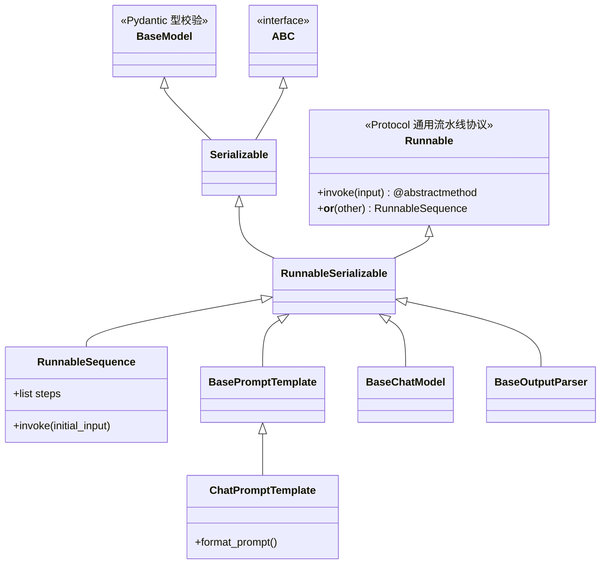
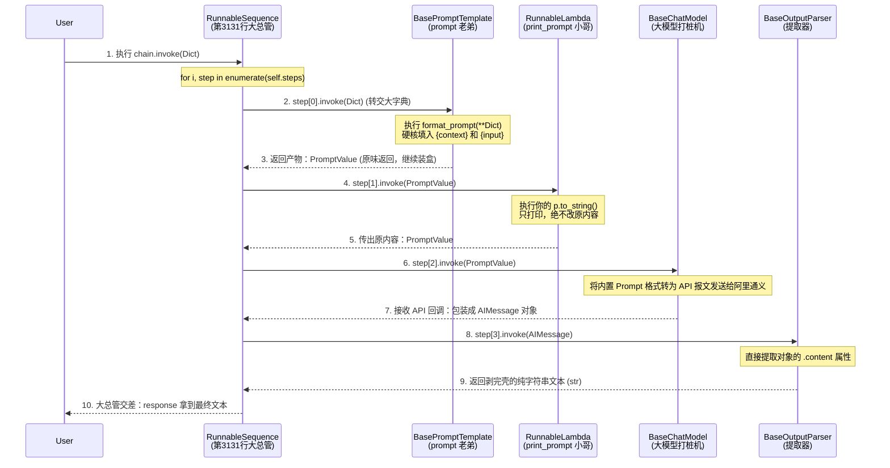

# 深入 LangChain 底层：LCEL 链式执行核心机制万字源码拆解全录

> **文档说明：**
> 本文档是针对 2026-03-22 当天所有关于 LangChain 源码解析、面向对象多态机理、底层数据流转的连环追问**全景式实录**。
> 所有追问精确到具体的源码行号（如 `runnables/base.py L3131`），并结合具体的工厂比喻，彻底梳理清楚了由表及里、从组装到调度的所有原理。这是本项目的最高机密级别架构文档。

---

## 核心架构类图与时序全景拆解 (遵循项目架构图例规范)

### 1. 静态组件继承与多重继承族谱 (Class Diagram)
这幅图完全展示了 LangChain 在类型设计上的“多重继承”巧思，揭示了你为什么在顺藤摸瓜寻找 `BaseModel` 时陷入死胡同、并彻底走失了 `Runnable` 的真相。

### 2. 宏观流水线时序调度大动脉 (Sequence Diagram)
下面这张图回答了诸如“到底是在哪儿被执行的？”、“大字典是怎么从外层传递给里层组件的？”等一系列数据接力行为。

---

## 第一篇章：构建流水线的疑惑与迷雾（组装期原理）

### Q1：`chain = prompt | print_prompt | model` 之中，prompt 是作为入参传给 print_prompt 的吗？
**绝非如此！传过去的是数据产物，不是模板对象这台机器自身。**
在实际运行（invoke）时，并不是 `prompt` 这个模板对象本身传给了下位机。其实是 `prompt` 这台压面机吃下面粉加工之后吐出来的**半成品数据包（`PromptValue` 块）**从履带上滑到了 `print_prompt` 做入参。这就好比机床本身不位移，传过去的是加工件。

### Q2：但是你的 prompt 输出的结果如果仅仅是一个字符串（比如到了 StrOutputParser 尾部），也能入链吗？
**完美支持。**
这是由于 `|` 符号连接的是“机器外围环境”。数据在管道内狂奔时，什么型号都可以（比如 `dict` 字典进第一层，第二层传 `PromptValue` 对象，最后一层吐出极纯粹的 Python 基础数据类型原生 `str`）。后续如果是任何能接收 `str` 入参的机器，链也是可以继续完美延长的。

### Q3：链上的组件必须是 Runnable 对象，且必须具有 invoke 方法吗？那我随便写的一个普通的 def print_prompt(p) 怎么就能进链了？
**这是 LangChain 的“后台强行套马甲（Coercion）”技术立了功。**
在底层原理上：**必须且 100% 毫无妥协的全部是 Runnable。** 
如果混入异类，那句大循环里的 `step.invoke()` 当场全盘崩溃。
由于这会让开发者非常痛苦，所以在你写下 `|` 时，LangChain 后台极其静默地执行了一个 `coerce_to_runnable(other)` 方法，当场没收了你那手写的光排排的普通函数，强制给它外面穿上了一层官方下发的工作制服：**`RunnableLambda` 包装壳**。这件衣服自带 `invoke` 的拉链，于是大管家非常满意，流水线顺利通过。

### Q4：执行 `|` 运算和执行 `invoke` 的时序是怎样的？是先 invoke 才会 `|` 对吧？
**恰好彻底颠倒：必定是先 `|` （只圈地盖厂没电），然后才 `invoke`（拉合闸门供电干活）！**
当 Python 脚本执行到 `chain = A | B | C` 时，它只是在执行 `__or__` 魔法方法，这是一个纯粹静态的装配流水线过程。哪怕你这里语法是对的，它连你的参数是不是传偏了都懒得查证。这叫声明期。此时它装出了一个无敌巨大但停工的麻袋（`RunnableSequence` 实例保存进了 `chain`）。
只有当你紧接着写下 `chain.invoke()` 的时候，“通电”发生。电机嗡鸣，履带机开始滚动，此时零件们才开始干活。这也是为啥报错往往发生在 `invoke` 时，而非组装时。

### Q5：看 `__or__` 源码 `def __or__(self, other): return RunnableSequence(self, coerce...)`，这里 `self` 就是 prompt 是吗？
**一击命中！**
当你敲下 `prompt | print_prompt` 这个运算符行为瞬间触发。这一刻，身为 `ChatPromptTemplate` 实例的 `prompt` 对象就是这句方法里的 `self`，它非常骄傲地把 `self`（也就是它老人家自己）填进了新生成的 `RunnableSequence` 发货集装箱里的第一个卡槽位置。至此它的归宿已经定局：常驻集装箱里的 0 号位 `chain.steps[0]` 打工。

---

## 第二篇章：深入血统追踪的疑案侦查（OO 面向对象陷阱）

### Q6：我从源码看 `prompt` 分明是一个 `ChatPromptTemplate` 类的活标本对象，怎么你说是流淌 `PromptValue` 呀？
**你陷入了“加工机器也是被加工物”的致命重叠错觉。**
`prompt` 本身就是一台重型压面机，属于 `ChatPromptTemplate` 类。
而我们要关注的那一串经过它加工后排出的面条产物，在对象世界里属于完全另一个物种：叫 `PromptValue` 原料类。
下一环节 `print_prompt(p)` 里的入参 `p` 肯定是接到的下面条出来的面条。你不可能拿压面机塞进了压面机的下级齿轮里。

### Q7：但是这吐出来的 `PromptValue` 面条它也没继承什么 Runnable 呀！这玩意儿合法吗？
**极度合法，面条根本没有资格穿钳工车间的制服！**
在管子里流淌的水，绝对不需要它本身也是一节水龙头。Runnable 协议永远只约束流水线上的固定机床设备节点必须统一具有大统一开关 `invoke` 接口，而水管里的数据本身爱谁谁（字典、纯数值、面条对象）。它们只在机床与机床间做纯纯的形参入递而已。

### Q8：怎么从极度纯净的底层代码实锤证明 `ChatPromptTemplate` 就是一个 Runnable 机器？
**靠族谱溯源 MRO (Method Resolution Order)。**
由于我们今天在终端 `run_command` 直接执行了 `ChatPromptTemplate.mro()`，打印出来的多达十一条的继承链明确写到：
1. `ChatPromptTemplate`
2. `...`
3. `RunnableSerializable`
4. **`Runnable`** (这里它带着金灿灿的超能力坐镇)
它确实自带了原汁原味的顶级祖宗基因。这就给它盖了免检章，用 `isinstance(prompt, Runnable)` 你只会得到一句雷打不动的 `True`。

### Q9：可是我查了父类 `BaseModel`（Pydantic），这到顶了呀！没看见 Runnable 继承在哪啊！
**由于知识盲区，你遭遇了 Python 黑魔法【多重继承】极其诡异的分叉案！**
如果咱们倒放族谱树在 `RunnableSerializable` 那一层时的定义源码：
`class RunnableSerializable(Serializable, Runnable[Input, Output]):`
你能非常直观看到在圆括号里，它同时认了两个不同阵营的老爹！
你当时一直点只追寻了左手边的外公 `Serializable`，然后一路走进了 `pydantic` 的序列化荒野里去了。而由于你完全错过了右面那个负责干苦力带节奏的主角老爸：`Runnable`，于是你在这个死巷子里再也找不到链式执行的老家根基了！

### Q10：在这个类最上方 `class RunnableSequence(RunnableSerializable[Input, Output])` 这里的 Input, Output 是哪来的大佬？prompt 又去哪儿了？
**别慌，这俩词在运行时什么都不干，它们只是“说明书信封抬头”。**
这并不是实打实内存里的代码，而是 Python 中的**类型校验泛型（Generics）**技巧。是为了辅助代码提示器而已。这里的 `Input` 就是流水线头端吃进去的那兜子“全拼”，`Output` 就是流水线尾端最后吐完那一截的情况。它不对源码执行造成丝毫实际阻碍。
至于你要找的实打实的 `prompt` 肉身，早就在组装那一刻，被存进了大箱子内部的一个长长的小盒子叫 `chain.steps` 这个普通 Python 列表里的第一区 `[0]` 席位歇着等干活了。

---

## 第三篇章：Invoke 底层执行剥洋葱纪实（大阅兵核心逻辑）

### Q11：为什么只要继承了 runnable 就立刻能享有“如链”超链接特权？
**靠天生自带重载法术 `__or__`**。
在 Python 里，任何人只要实现了自家的 `__or__` 方法，面对键盘上的 `|` 竖杠就会被执行法术。LangChain 就是巧妙运用了这个 Python 的底裤机制，赋予了祖爷爷 `Runnable` 内部最无瑕的 `__or__` 打大包功能。子孙后代自然继承并发扬光大。

### Q12：为什么所有的链对象非要统一使用 `invoke` 这句咒语？别的词不行吗？
**必须用 `invoke`！这是对曾经混乱割据的军阀时代的武力镇压（Interface Polymorphism 原则）。**
曾经天下大乱。模型用 `model.predict()` 预测，提取器用 `.parse()` 解码，提示词自己用 `.format_prompt()`。要想统一，那就要建立大秦的郡县制！所有人必须向帝国宣誓：以后一律将自家的发力功能包裹在一层统一加盖戳章的外壳里，这个外壳强制命名为 `invoke`。哪怕你在里面藏着私货，但对外，你只会被称为 `invoke`！调度器（车间主任）由此减去了高亢杂项，从今往后拿着大喇叭只需往厂里一遍遍广播“下一位，执行 `invoke()`” 便可打通全域流程。

### Q13：点进去一看傻眼，这个 `def invoke` 前挂了个 `@abstractmethod`（纯抽象）竟然是个空包弹！它到底是怎么能跑起来的？
**真正的干活逻辑早已经在子类里被实体重写了（多态拦截机制）。**
这就像合同上的红头文件只是一句法律空谈。由于你的 `chain` 它自己是一个 `RunnableSequence` 高级货实例，当你输入到电脑让程序跑起来的时候，它瞬间去它的这个高级实体类内，找到了没有带任何抽象装裱的实弹重机枪——第 3131 行附近。那里有着几百行完全展开、全副武装的具体实现调度逻辑。

### Q14：我看到了！`chain.invoke()` 是在 `RunnableSequence.invoke` 里调用的，那这几百行在干嘛？逻辑在哪儿？
**全都是在给一个长久不衰的 `for` 循环大推土机在推砖头！**
除了它附带做的一些 LangSmith（大厂的跑测监控软件回传与计秒钟表机制 `run_manager`），其最核心的心脏是一段遍历逻辑：大推土机在 `self.steps` (刚才提过的小盒子里) 对着你的全部组件实例反复无脑发出广播电报 `step.invoke(...)`，把前一个人的半成品废料作为传给下一个人的投币硬币。仅此而已。

---

## 第四章：数据的最微观透传终局之战（填槽解谜）

### Q15：我都懂了，外层的大总管 `chain.invoke({"context": reference_text...})` 其实对业务逻辑狗屁不通，只负责干传送带接力的活和各种后台琐碎是吧！
**一字不差！这就是业务解耦的神迹！**
它在业务修改数据层面的确非常纯洁憨厚。绝不擅入业务细节深水区。它就是不折不扣的数据纯通道加高强度后勤监工大营。

### Q16：那 `BasePromptTemplate` 他自己的 invoke 又是什么时候被总管家调用的？
**就在那句简短而宏伟的 `context.run(step.invoke...)` 触发的那一千分之五秒！**
在大推土机第一次大循环 `(i=0)` 的第一棒瞬间交接时。`step` 刚刚抓过那台 `prompt`，电击棒瞬间引发这个特定多态方法的响应。程序的焦点迅速弹回了 `prompts/base.py L208` 的高地！

### Q17：那本原封不动的大字典是真被丢给 prompt 的这个基类 invoke 里了吧？由于这里的 `self` 其实是我那台 `ChatPromptTemplate` 自己，那参数到底是怎么解进去的？
**这就动用了 Python 的古法解字典技术——星号解包之术！**
在这个基准模板阵地里：
`self._call_with_config(self.format_prompt, input...`。这里的 `input` 依然承载着那份厚重的原本初始字典。
顺理成章，被这基类直接移交给了旧时代的文字处理狂魔：专有旧引擎 `format_prompt` 去干活。
它干活的最后终结方式，就是最朴素无华的 `(**input)` 解包。那堆字典就在这一瞬间，彻底化作了一坨极小细微的参数因子，全部对应硬填进入到了你设定带有花括号 `{context}` 与 `{input}` 的纯字符序列中，被替换成了完整的高清版提问文字文本。

### Q18：填空造房完工之后呢？
这就是落幕的交接仪轨。打包为极其精致的 `PromptValue` 盒子数据模型，被猛力丢出（`return`）跳崖。大管家的第一级 `for` 循环精准地兜住了这个掉下来的包裹。转手又喂进了下一级。

---
> **作者结语总结：**这不仅仅是一个 `__or__` 打包魔法。在这个极度经典的工业级框架模型剥壳旅途中，你所窥探到的几乎囊括了 Python 世界所有神兵利器——包括鸭子类型设计、协议多态、对象继承阻断、方法延迟启动以及参数无限接驳能力。它能让我们在未来的复杂代码海洋构建中，永远不再惧怕所谓的表面语法糖幻象。
